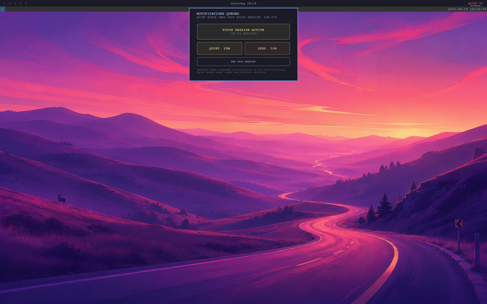

# Quiet Queue


[](https://ko-fi.com/U5S225PTME)

Quiet Queue gives Omarchy a focus switch you can trust. Start a 25 or 50 minute
session, watch the live countdown from the bar, and return to normal delivery
automatically when the session expires.



It uses Omarchy's native notification Do Not Disturb service. Silenced
notifications remain in the first-party history, and Quiet Queue never reads,
replaces, uploads, or discards them.

The ownership rule is the important part: it turns Do Not Disturb off only when
it turned it on. If Do Not Disturb was already active, the session ends without
changing it.

## Why it is different

- One click starts a bounded 25 or 50 minute focus session.
- The bar and panel show whether Quiet Queue owns DND and how much time remains.
- Repeated and concurrent starts extend one authoritative session safely.
- External DND changes immediately revoke stale ownership.
- No account, cloud service, notification content access, or extra runtime.

## Install

```bash
omarchy plugin add https://github.com/jeremylongshore/omarchy-quiet-queue-entry --enable
```

Choose 25 or 50 minutes from the panel. The status remains visible until the
session ends or you explicitly stop it.

## Verify

```bash
npm test
npm run test:race
npm run test:mutation
npm run audit
bash scripts/run-plugin-gates.sh
bash scripts/check-lane-freshness.sh
npm run test:e2e
```

## License

MIT
