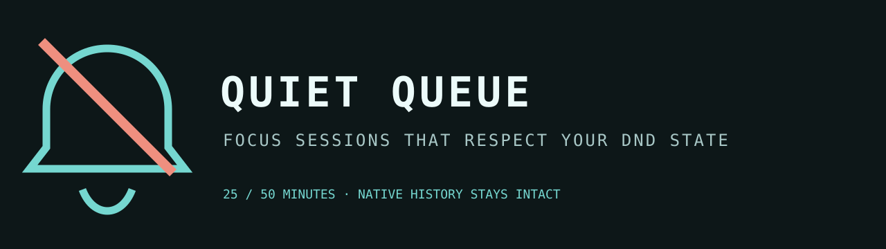

# Quiet Queue



[](https://ko-fi.com/U5S225PTME)

Quiet Queue starts a deliberate 25 or 50 minute quiet session through Omarchy's
native notification Do Not Disturb IPC. Silenced notifications remain in the
first-party history; Quiet Queue never reads, replaces, or discards them.

The ownership rule is the important part: it turns Do Not Disturb off only when
it turned it on. If Do Not Disturb was already active, the session ends without
changing it.

## Install

```bash
omarchy plugin add https://github.com/jeremylongshore/omarchy-quiet-queue-entry --enable
```

Choose 25 or 50 minutes from the panel. The status remains visible until the
session ends or you explicitly stop it.

## Verify

```bash
npm test
bash scripts/run-plugin-gates.sh
bash scripts/check-lane-freshness.sh
bash scripts/rig-verify.sh .
bash scripts/rig-render.sh . preview.png
```

## License

MIT
